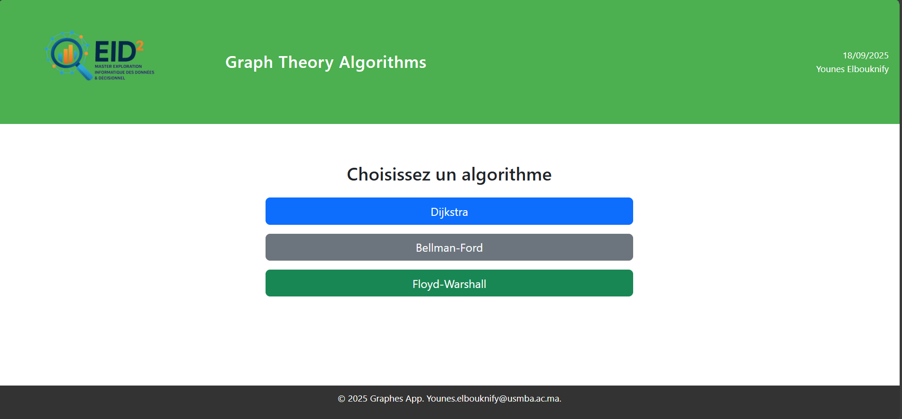
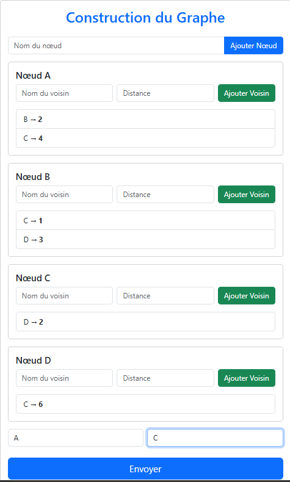

```markdown
# 📊 Graph Theory Algorithms

Un projet académique et pratique qui implémente différents **algorithmes de la théorie des graphes** avec une interface moderne et une visualisation interactive.  
L’objectif est de fournir un outil simple, pédagogique et extensible pour explorer et tester les algorithmes classiques des graphes.  

---

## ✨ Fonctionnalités

- 🔹 Implémentation des algorithmes classiques :
  - **Dijkstra** (plus court chemin)
  - **Floyd–Warshall** (tous les plus courts chemins)
  - **Bellman–Ford**
- 🔹 Visualisation interactive des graphes
- 🔹 Ajout de graphes dynamiques via formulaire
- 🔹 Interface moderne et responsive
- 🔹 Code clair et documenté

---

## 🛠️ Technologies utilisées

- **Frontend :** React + TailwindCSS (visualisation & interface utilisateur)  
- **Backend :** Python (Flask ou FastAPI pour exposer les algorithmes)  
- **Langages :** JavaScript, Python  
- **Outils :** Git, VS Code, Node.js  

---


---

## ⚡ Installation et exécution

### 1️⃣ Cloner le projet
```bash
git clone https://github.com/YOUNESELBOUKNIFY/Graphalgo.git

cd Graphelgo
````

### 2️⃣ Lancer le backend (Python)

```bash
cd graph-app-backend

 python -m venv venv

 .\venv\Scripts\Activate.ps1

pip install -r requirements.txt 

uvicorn app.main:app --reload
```

### 3️⃣ Lancer le frontend (React)

```bash
cd graphes-frontend
npm install
npm start
```


---


---

## 📸 Exemple de rendu (UI)
### Menu 


### Construction du Graphe



### Visualisation 2D :

---

## 👨‍💻 Auteur

* **Younes Elbouknify**
  Étudiant en Master **WISD** (Web Intelligence & Data Science)
  Université Sidi Mohamed Ben Abdellah – FSDM

📧 Contact : \[[younes.elbouknify@edu.univ-paris13.fr](younes.elbouknify@edu.univ-paris13.fr)]

---


## ⭐ Remerciements

* Inspiré par les cours de **Théorie des Graphes et Algorithmes**


---

